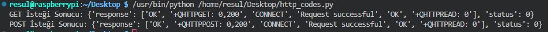

# Week 4 Report

## Tasks and Progress Status

### Development of Serial Port Auto-Detection Feature
- Implemented an advanced function in Python for automatically detecting serial ports. 
- Utilized the `serial.tools.list_ports` module to scan and identify available ports.
- Integrated a method to filter ports based on specific USB device identifiers (VID and PID), ensuring the correct modem is selected for communication.
- Conducted tests to ensure the function accurately identifies the desired modem among multiple connected devices.

    ```python
    @staticmethod
    def find_modem_port():
        ports = list(serial.tools.list_ports.comports())
        for port in ports:
            if "VID:PID=2C7C:0125" in port.hwid.upper():
                return port.device
        return None


### Crafting HTTP GET and POST Request Functions
- Developed function to handle HTTP GET and POST requests through AT commands.
- Used AT+QHTTPCFG and AT+QHTTPURL commands for setting up HTTP sessions. These work for both GET and POST requests. 
- For GET requests, used AT+QHTTPGET and AT+QHTTPREAD commands. AT+QHTTPGET starts the GET request, and AT+QHTTPREAD lets us read what the server sends back.
- For POST requests, used AT+QHTTPPOST with AT+QHTTPREAD. AT+QHTTPPOST sends data to the server, and AT+QHTTPREAD helps us see the server's response.

    ```python
    def http_request(self, url, method='GET', data=None):        
        self.send_at_command('AT+QIACT?', 0)
        self.send_at_command('AT+QICSGP=1,1,"Turkcell Twilio","","",1', 0)
        self.send_at_command('AT+QIACT=1', 0)
        self.send_at_command('AT+QHTTPCFG="contextid",1', 0)
        self.send_at_command(f'AT+QHTTPURL={len(url)},80', 0)
        self.send_at_command(url, 0)

        if method == 'GET':
            response = self.send_at_command('AT+QHTTPGET=80', 2)
        else:
            self.send_at_command(f'AT+QHTTPPOST={len(data)},80,80', 0)
            response = self.send_at_command(data, 0)

        response += self.send_at_command('AT+QHTTPREAD=80', 1)
        return self.filter_response(response)


- A class that uses the ModemCommunicator library and sends HTTP requests has been developed.

    ```python
    from ModemCommunicator import ModemCommunicator

    def send_http_get(url):
        modem = ModemCommunicator()
        try:
            response = modem.http_request(url, method='GET')
            return response
        finally:
            modem.close()

    def send_http_post(url, data):
        modem = ModemCommunicator()
        try:
            response = modem.http_request(url, method='POST', data=data)
            return response
        finally:
            modem.close()

    if __name__ == "__main__":
        get_url = "https://webhook.site/fbe25b48-2ea0-48a8-bf78"
        post_url = "https://webhook.site/fbe25b48-2ea0-48a8-bf78"
        post_data = "data=deneme"
        
        print("GET İsteği Sonucu:", send_http_get(get_url))
        print("POST İsteği Sonucu:", send_http_post(post_url, post_data))



- Added a `filter_response` function to process and clean up the responses received from the server.

    ```python
    def filter_response(self, response):
        lines = response.replace('\r', '').split('\n')
        filtered_response = {'response': [], 'status': 0}
        search_terms = ('+QHTTPGET', '+QHTTPPOST', '+QHTTPREAD', 'Request successful', 'OK', 'CONNECT')

        for line in lines:
            line = line.strip()
            if line.startswith(search_terms):
                filtered_response['response'].append(line)

        return filtered_response


### Improvements in AT Command Communication
- Improved the send_at_command method by adding a flag parameter. This helps to manage different kinds of responses and the time it takes to receive them.

    ```python
    def send_at_command(self, command, flag): 
        self.ser.write((command + '\r\n').encode())
    
        if flag in [0, 2]:
            time.sleep(1)
        elif flag == 1:
            time.sleep(4)

        response = self.ser.read(self.ser.in_waiting).decode()

        if flag in [2, 3]:
            time.sleep(1)

        return response


### Challenges and Solutions
- Faced '+CME ERROR 703' messages at HTTP GET. Fixed this by waiting longer for responses in our code.

## References
- [Sixfab HTTP AT Commands Manual](https://sixfab.com/wp-content/uploads/2018/09/Quectel_EC2xEG9xEM05_HTTPS_AT_Commands_Manual_V1.0.pdf)
- [Sixfab AT Commands Manual](https://sixfab.com/wp-content/uploads/2021/06/Quectel_EC2xEG9xEG2x-GEM05_Series_AT_Commands_Manual_V2.0.pdf)-
- [Solution of +CME ERROR 703](https://forums.quectel.com/t/recovery-from-cme-error-703/3268)